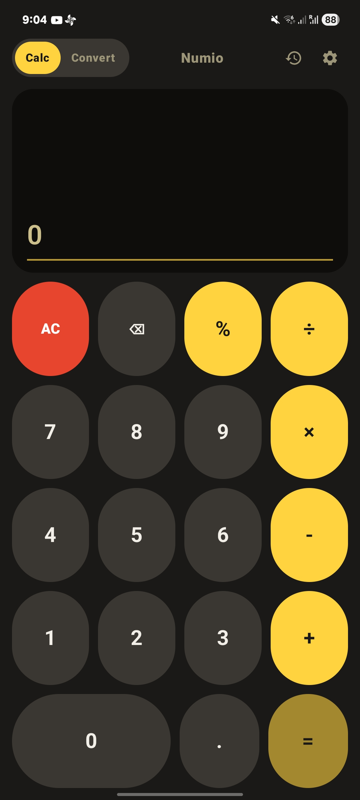
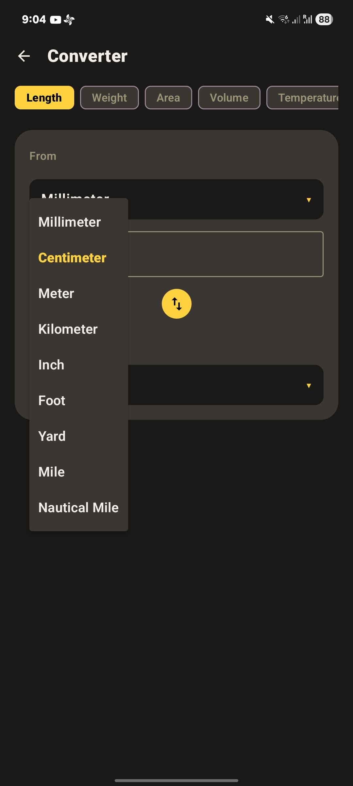
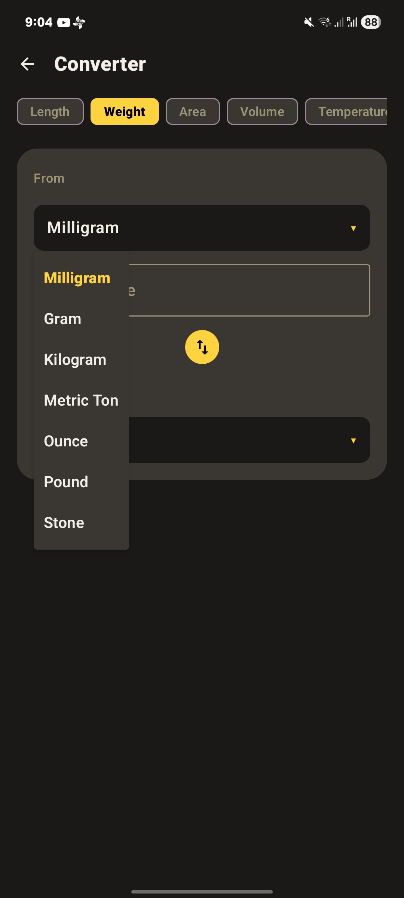
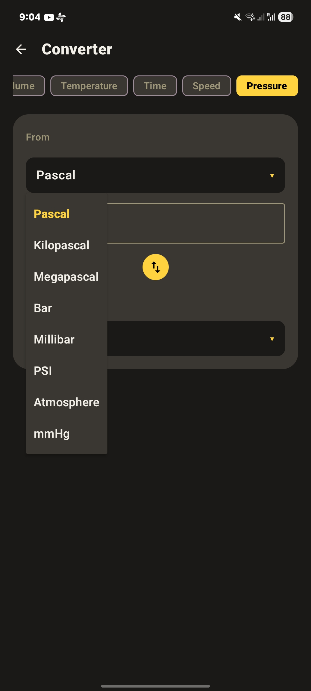
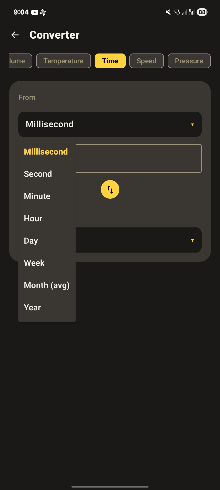
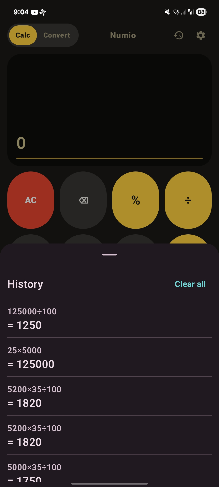
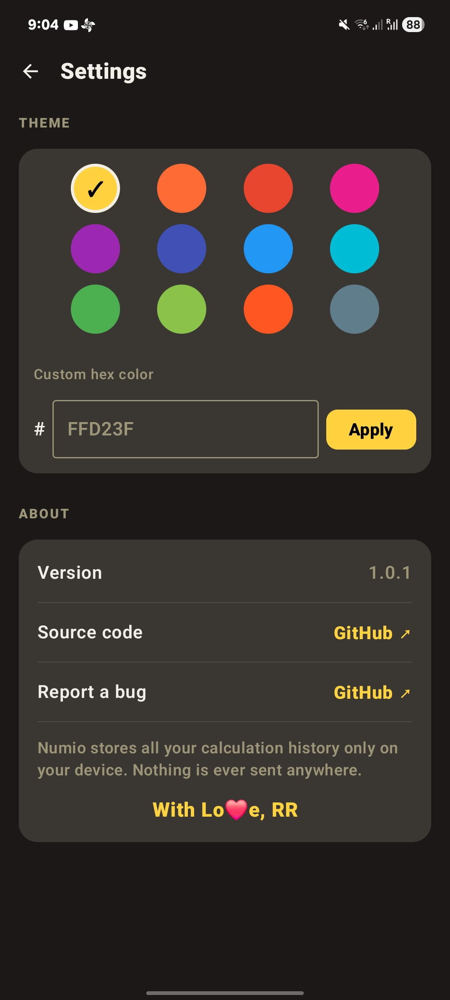

# Numio — Calculator App

A clean, minimal, open-source Android calculator app built with Kotlin & Jetpack Compose.
No ads. No tracking. No internet permission. Just a calculator.

## Features

- ✅ Clean, minimal calculator with retro circular keys
- ✅ Live results — see the answer as you type
- ✅ Scrollable expression display — no more truncated numbers
- ✅ Calculation history saved locally with Room database
- ✅ Unit Converter — Length, Weight, Area, Volume, Temperature, Time, Speed, Pressure
- ✅ Theme customization — 12 preset accent colors + custom hex input
- ✅ Your chosen color persists across sessions
- ✅ Hand-drawn custom app icon
- ✅ A little easter egg 🤫
- ✅ 100% offline — nothing ever leaves your device

## Screenshots

  
  
  
  

  
  
  

## Download

Get the latest APK from [Releases](https://github.com/rag-creation/numio/releases/latest).

F-Droid version coming soon.

## Requirements

- Android 7.0 (API 24) or higher

## Built With

- [Kotlin](https://kotlinlang.org/)
- [Jetpack Compose](https://developer.android.com/jetpack/compose)
- [Room](https://developer.android.com/jetpack/androidx/releases/room)
- [DataStore](https://developer.android.com/jetpack/androidx/releases/datastore)
- [Navigation Compose](https://developer.android.com/jetpack/compose/navigation)
- [exp4j](https://www.objecthunter.net/exp4j/)

## License

GPL-3.0 — see [LICENSE](LICENSE)

## Contributing

Issues and pull requests are welcome! If you find a bug or have a feature idea, open an issue.

## About

This is my first ever coding project, built from scratch with no prior coding experience —
with the help of Claude AI as my coding assistant.

With Lo❤️e, R.R
